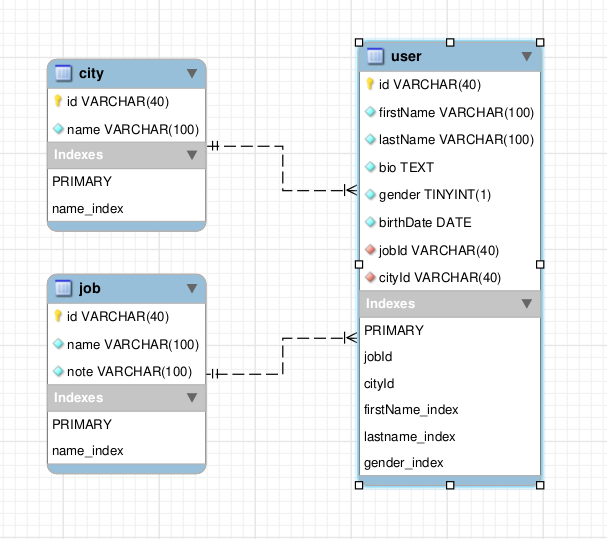
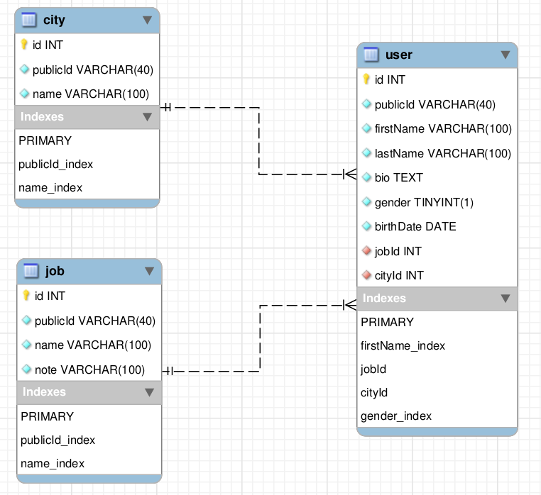
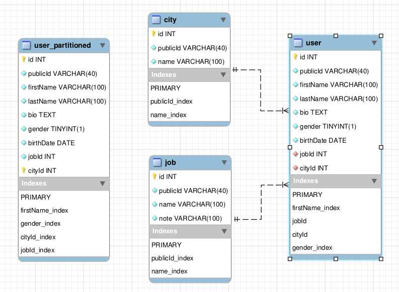

# Introduction
this experiment shows what you actually expect when working with 1 billion record database, it tests and compares the performance of queries on a single table of 1 billion records against another partitioned table of 1 billion records.


# intial schema
this is the schema that we will start with.



the plan is to populate the tables before testing to contain these number of rows:
- user table: 1 billion records
- city table: 2 million records
- job table: 1 million records

# problems that may arise
    - space issue 
        - move data partition 
        - disable binlog during insertion

# building a 1 billion record table 

* this section walks us through populating the database in different situations.
* within each trial we do a little change and watch its effect on insertion performance.
* each trial is associated with a **js** file that automates the inserion operation (scripts folder).

1. **building the table with random UUID, add indexes before insertion**
    
    - this approach uses the intial schema  
    - this test is done by running **[fakedbInitial.js](./scripts/fakeDbInitial.js)** 
    - the test is done at **128 MB** *[innodb_buffer_pool_size](https://dev.mysql.com/doc/refman/8.4/en/innodb-parameters.html#sysvar_innodb_buffer_pool_size)*.
    - the script creates the schema for each table and the associated indexes first before insertion.
    - the script creates a random UUID for each record
    - insertion occurs in chunks where each chunk is 10K rows.
    - this table shows time consumed to insert each bulk into city table
   
        | bulk No. | Time (MM:SS) |
        |:---------:|:------------:|
        |     1     |     0:03     |
        |     2     |     0:03     |
        |     3     |     0:02     |
        |     4     |     0:03     |
        |     5     |     0:04     |
        |     6     |     0:05     |
        |     7     |     0:05     |
        |     8     |     0:11     |
        |     9     |     0:20     |
        |    10     |     1:31     |
        |    11     |     1:42     |
        |    12     |     1:53     |
        |    13     |     1:02     |
        |    14     |     1:11     |
        |    15     |     1:18     |
        |    16     |     1:26     |
        |    17     |     2:35     |
        |    18     |     2:48     |
        |    19     |     2:54     |
        |    20     |     2:05     |


        this is the time taken to insert **2 million** rows in the city table, it took about **21 mins**, which is very slow if want to apply the same approach to the users table


2. **repeat the previous step with **0.5 GB** *[innodb_buffer_pool_size](https://dev.mysql.com/doc/refman/8.4/en/innodb-parameters.html#sysvar_innodb_buffer_pool_size)***
    
    - open a Mysql session through terminal / any DB management tool 
        - run this command:<br/>
        ```sql
        SET GLOBAL innodb_buffer_pool_size = 536870912;
        ```

    - rerun the same script again **[fakedbInitial.js](./scripts/fakeDbInitial.js)** 
    - time tracked for insertion operations into the city table

        | Bulk No. | Time (MM:SS) |
        |:--------:|:------------:|
        |     1    |     0:03     |
        |     2    |     0:03     |
        |     3    |     0:03     |
        |     4    |     0:02     |
        |     5    |     0:03     |
        |     6    |     0:06     |
        |     7    |     0:03     |
        |     8    |     0:04     |
        |     9    |     0:05     |
        |    10    |     0:07     |
        |    11    |     0:06     |
        |    12    |     0:06     |
        |    13    |     0:07     |
        |    14    |     0:08     |
        |    15    |     0:07     |
        |    16    |     0:08     |
        |    17    |     0:08     |
        |    18    |     0:09     |
        |    19    |     0:10     |
        |    20    |     0:09     |

        - you can see that increasing the buffer pool size has its effect on the time consumed for bulks inserted after the table got large (e.g. bulks 18, 19, 20).

    
    - checking the time consumed by inserting into "user" table

        | Bulk No. | Time (MM:SS) |
        |:--------:|:------------:|
        |     1    |     0:21     |
        |     2    |     0:13     |
        |     3    |     0:16     |
        |     4    |     0:23     |
        |     5    |     0:27     |
        |     6    |     1:31     |
        |    ...   |      ...     |
        |    23    |     4:08     |
        |    24    |     4:19     |
        |    25    |     5:47     |
        |    26    |     5:55     |
        |    27    |     5:41     |
        |    ...   |      ...     |
        |    48    |    10:39     |
        |    49    |    10:37     |
        |    50    |    10:45     |
        |    51    |    10:49     |
        |    52    |    11:32     |
        |    53    |    10:07     |
        |    ...   |      ...     |
        |    95    |    12:25     |
        |    96    |    12:22     |
        |    97    |    13:14     |
        |    98    |    13:34     |
        |    99    |    13:38     |
        |   100    |    13:17     |

        - it takes so long at bulk No. 100, so we decided not to complete the insertion opertation ( **99,900** bulks were remaining to complete 1 billion records )


3. **repeat the insertion process with auto increment ID instead of UUID**
    
    - use **[fakeDbAutoInc.js](./scripts/fakeDbAutoInc.js)**.
        - this file is just a modification over the previous one **[fakedbInitial.js](./scripts/fakeDbInitial.js)** where we replace random UUIDs with sequential integers.
    
    - checking time durations of insertion into "user" table again for the first 5000 bulks

        | Bulk No. | Time (MM:SS) |
        |:--------:|:------------:|
        |     1    |     0:02     |
        |     2    |     0:01     |
        |     3    |     0:00     |
        |     4    |     0:01     |
        |     5    |     0:01     |
        |     6    |     0:01     |
        |     7    |     0:00     |
        |     8    |     0:01     |
        |     9    |     0:01     |
        |   ...    |      ...     |
        |   4988   |     0:00     |
        |   4989   |     0:01     |
        |   4990   |     0:00     |
        |   4991   |     0:01     |
        |   4992   |     0:01     |
        |   4993   |     0:02     |
        |   4994   |     0:00     |
        |   4995   |     0:01     |
        |   4996   |     0:00     |
        |   4997   |     0:01     |
        |   4998   |     0:00     |
        |   4999   |     0:01     |
        |   5000   |     0:01     |

    - notice the significant decrease in the insertion time just because of replacing random UUID with sequential integers
    
    - **this result shows us that**:
        1. reodering secondary indexes while insertion is more cheaper than reodering primary index.
        
        2. a non sequential primary key reduces  bulk insertion performance.

4. **repeat the insertion process with sequential UUID instead of Auto inc.**

    - this test will show us the key factor behind the insertion performance degradation, whether it's caused by the randomness of the **PK** or by the data type(fixed varchar / integer) of the **PK**.

    - use the script **[fakeDbSeqUUID.js](./scripts/fakeDbSeqUUID.js)**
    
    - we checked then the time consumed by each bulk till bulk No.5000 for the "user" table

        | Bulk No. | Time (MM:SS) |
        |:--------:|:------------:|
        |     1    |     0:01     |
        |     2    |     0:00     |
        |     3    |     0:00     |
        |     4    |     0:00     |
        |     5    |     0:01     |
        |     6    |     0:01     |
        |     7    |     0:01     |
        |     8    |     0:01     |
        |     9    |     0:00     |
        |    10    |     0:01     |
        |    11    |     0:01     |
        |    12    |     0:01     |
        |    13    |     0:00     |
        |   ...    |      ...     |
        |   4982   |     0:03     |
        |   4983   |     0:03     |
        |   4984   |     0:04     |
        |   4985   |     0:03     |
        |   4986   |     0:03     |
        |   4987   |     0:03     |
        |   4988   |     0:03     |
        |   4989   |     0:03     |
        |   4990   |     0:03     |
        |   4991   |     0:03     |
        |   4992   |     0:03     |
        |   4993   |     0:03     |
        |   4994   |     0:04     |
        |   4995   |     0:03     |
        |   4996   |     0:03     |
        |   4997   |     0:03     |
        |   4998   |     0:03     |
        |   4999   |     0:05     |
        |   5000   |     0:02     |

    - by comparing against the results from the previous test, we are sure now that the key factor behind perfomance degradation was the randomness of the UUID not the UUID itself, however you can see that sequential integers are better. 


5. **revert back to AutoInc ID and delay index creation till insertion complete**

    - use **[fakeDbBillion.js](./scripts/fakeDbBillion.js)**
        - this script uses the AutoInc scheme
        - it also delays index creation operations till all bulks are inserted.

    - this method yeilds the best insertion performance, as:
        - all records are ordered by nature because of sequential key
        - there are no indexes to worry about while insertion. 
    
    - results:
        - 100,000,000 records took about 22 mins.
        - populating the table with 900_000_000 records took about 3hrs 20 mins.
        - building index for firstName col when the table has 100_000_000 records took 6.5 mins
        - building index for firstname col when the table has 200_000_000 records took 13.25 mins
        - building index for firstname col when the table has 700_000_000 records took 38.3 mins
        - building index for firstName col when the table has 900_000_000 records took 58 mins 

# schema after updates


- changed id cols to integer Auto inc. instead of varchar
- added public ID column (*just an additional col. to increase row width*)

# building a partitioned table
    
- we decided to add a new user table to the schema in the partitioned form so
we can compare the performance of operationg queries on both to see if we can benefit
from partitioning in case of having large number of rows

- you can choose the best partition key according to your case or your need, here it seems real and rational to partition users just by the city they live in, this is just as example, you are free to do what you want (partition by birth year / job / ...) according to your case.

- the table is partitioned by range, into 200 partitions, each covers a series of sequential ids of cities

- schema after adding the partitioned table 
    

- data is distributed evenly across partitions ( ~ 5 million records per partition ).
- columns in both tables (user & user_partitioned) have the same cardinality.

- **restrictions:**
    1. table primary key is **(id, cityId)**, this is because Mysql adds a restriction that
        
        > *[every unique key on the table must use every column in the table's partitioning expression](https://dev.mysql.com/doc/refman/8.4/en/partitioning-limitations-partitioning-keys-unique-keys.html)*.

        ,and since the primary key is a unique key, then it should include the cityId.

    2. you can't have foreign key constraints (cityId & jobId) inside a partitioned table,

        > *[Foreign keys not supported for partitioned InnoDB tables](https://dev.mysql.com/doc/refman/8.4/en/partitioning-limitations.html)*. 


# data distribution inside tables

- city and job tables have duplicates, so you can find multiple cities have the same name and multiple jobs have the same name.

- for the partitioned table:
    - it's clear that users are partitioned by cityID
    - since cities have duplicate names, then you should expect to find users in partion "**A**" with city name "***london***" ,and expect to find users in partition "**K**" with city name "***london***" however, the first "***london***" city has different ID from the second "***london***" city (2 different cities with same name).

- the duplication is because of the limited random values provided by the faker package.
    
- we decided to pick some cities and tweak their names to make them unique throughout the whole table to see the effect of operationg on unique values.


# testing environment

- **machine specs**
    - 11th Gen Intel® Core™ i7-11800H @ 2.30GHz × 16.
    - 16 GB DDR4 memory.
    - 1 TB crucial P2 NVMe SSD

- **mysql version**
    - 8.0.4 community edition

- **OS**
    - Ubuntu 22.04.5 LTS 


# How are tests evaluated

- the following tests are based on the bash script **[load-test.sh](./load-test.sh)**.
    - the script initiates a mysqldump command and watches **cpu** & **memory** usage during the test.
    - for each test we tweak these parameters inside the script accordingly:
        - **concurrency:** 
            - number of concurrent connections firing queries
        - **iterations:** 
            - number of times to repeat the test (result will be avg of all iterations), this is essential to avoid misleading values generated before warming up or in case data is cached. 
        - **path-to-sql-script:** 
            - path to the sql script containing queries to run **per connection**

            > queries inside the sql file are similar in structure most of the time but differ in values associated with where clauses, we did that to force MySQL to use different parts of tables involved instead of using a group of cached pages ( happens when you fire the same query multiple times ) which is not like the real world.
    
- for each benchmark check the corresponding folder (**tests**) to see the queries used and a detailed results report.
    - the test is either on the single table or on the partitioned table
    - test results are 2 files:
        - load-test-profile :
            - contain the whole cpu & memory values sampled during the test
                > samples are recorded against the **mysqld** service. 
        - load-test-results :
            - contain average values for time, cpu & memory.
            
            **e.g.**
            <pre>

                Average number of seconds to run all queries: 330.215 seconds
                Minimum number of seconds to run all queries: 305.508 seconds
                Maximum number of seconds to run all queries: 346.523 seconds
                Number of clients running queries: 3
                Average number of queries per client: 5

                samples = 9287

                avgMem = 25.64 %
                maxMem = 26.2
                minMem = 7.5

                avgCpu = 4.53 %
                minCpu = 0
                maxCpu = 37.50
            </pre>

            - min, max and avg no of seconds are calculated across all iteration, ie: we calculate the time consumed by each iteration separately, and then we get the min, the max &  calculate the average **(t<sub>itr1</sub> +  t<sub>itr2</sub> + t<sub>itr3</sub> + ...) / #itr** of all.


# test1 (test O)    
**filter users by non unique city name**<br/>

- **purpose:**
        
    this test shows the performance when running a query that filters the large table by a field in a second joined table.


- **description:**

    this test is run at <strong>128 MB</strong> <i><a href="https://dev.mysql.com/doc/refman/8.4/en/innodb-parameters.html#sysvar_innodb_buffer_pool_size">innodb_buffer_pool_size</a></i>, once on the single table, and once on the partitioned table.    
    


- **query to be tested:**

    we have 2 sql files (<a href="./tests/test%201/single-table.sql">single-table.sql</a>,  <a href="./tests/test%201/partitioned-table.sql">partitioned- table.sql</a>) , with 20 queries per each file, one contains queries to be run on the single table and the other contains queries to be run on the partitioned table, queries in each file have these forms:


    - single table:
        ```sql
        select * from population.user 
            left join city on user.cityId = city.id 
            left join job on user.jobId = job.id 
        where 
            city.name = 'CITY_NAME' 
        limit 20;
        ```
    - partitioned table:
        ```sql
        select * from population.user_partitioned 
            left join city on user_partitioned.cityId = city.id 
            left join job on user_partitioned.jobId = job.id 
        where 
            city.name = 'CITY_NAME' 
        limit 20;
        ```
<br/><br/>  

- **results** :<br/>
    - test at 128MB *[innodb_buffer_pool_size](https://dev.mysql.com/doc/refman/8.4/en/innodb-parameters.html#sysvar_innodb_buffer_pool_size)* :<br/><br/>
        <table border="1" style="border-collapse: collapse; text-align: center;">
            <tr>
                <th rowspan="2">Concurrency</th>
                <th colspan="3">Single Table</th>
                <th colspan="3">Partitioned Table</th>
            </tr>
            <tr>
                <th>Avg Mem</th>
                <th>Avg CPU</th>
                <th>Avg Time (sec)</th>
                <th>Avg Mem</th>
                <th>Avg CPU</th>
                <th>Avg Time (sec)</th>
            </tr>
            <tr>
                <td>50</td>
                <td>4.30%</td>
                <td>47.77%</td>
                <td>0.092</td>
                <td>4.30%</td>
                <td>62.64%</td>
                <td>0.140</td>
            </tr>
            <tr>
                <td>100</td>
                <td>4.30%</td>
                <td>61.39%</td>
                <td>0.168</td>
                <td>4.30%</td>
                <td>73.82%</td>
                <td>0.296</td>
            </tr>
            <tr>
                <td>200</td>
                <td>4.32%</td>
                <td>71.89%</td>
                <td>0.314</td>
                <td>4.43%</td>
                <td>77.35%</td>
                <td>0.624</td>
            </tr>
            <tr>
                <td>400</td>
                <td>5.23%</td>
                <td>83.92%</td>
                <td>0.753</td>
                <td>5.94%</td>
                <td>85.34%</td>
                <td>0.848</td>
            </tr>
        </table>

        by comparing time elapsed during the test, we can see that:<br/>
        - a single table is better in case we just need filtering.
            - the reason is because the table partitions each has it's own index, so
                the engine will need to search separately throughout each index and collect 
                the results from each and this involves read of non adjacent index pages from the disk, while on the opposite side, the optimizer needs to search only once and fetch all the needed pages of the index at once.

        - performance is acceptable when filtering through an index of a large table
<br/><br/>

- **comparing the plans of each** :
    - single table: <br/> 
        
    <br/><br/>

    - partitioned table: <br/> 
        

    they show similar plans, where the optimizer :
        
    1. uses the name_index to find the atual rows from the city table that satisfies the where clause.
        
    2. after reading the rows from city table, it uses the cityId field to initiate a search into the cityId index of the users table, then it reads the actual rows satisfying the join condition (cityId = user.cityId), then rows from the users table are joined to the rows fetched from city table.

    3. it then uses the jobId field from the rows from the users table to issue a search into the job primary index.<br/>

# test2 (test O')
**filter users by non unique city name + sorting by user firstName column**

- **purpose :**

    this test adds further restriction to the previous one, where we need to sort results by a field in the <strong>large table</strong> after filtering by a field in the <strong>second table</strong>.
    


- **description :** 

   run the test for the single & the partitioned tables at different values of <i><a href="https://dev.mysql.com/doc/refman/8.4/en/innodb-parameters.html#sysvar_innodb_buffer_pool_size">innodb_buffer_pool_size</a></i> :<br/>

    * **128 MB**
    * **3 GB**
       
    
- **query to be tested :**

    we have 2 sql files (<a href="./tests/test%202/single-table.sql">single-table.sql</a>,  <a href="./tests/test%202/partitioned-table.sql">partitioned- table.sql</a>) , with <strong>5 queries per each file</strong>, one contains queries to be run on the single table and the other contains queries to be run on the partitioned table, queries in each file have these forms:

    - single table: 
        ```sql
            select * from population.user 
                left join city on user.cityId = city.id 
                left join job on user.jobId = job.id 
            where 
                city.name = 'CITY_NAME'
            order by firstName
            limit 20;
        ```
    - partitioned table:
        ```sql
            select * from population.user_partitioned 
                left join city on user_partitioned.cityId = city.id 
                left join job on user_partitioned.jobId = job.id 
            where 
                city.name = 'CITY_NAME'
            order by firstName
            limit 20;
        ```
    

- **results :**

    - 128MB *[innodb_buffer_pool_size](https://dev.mysql.com/doc/refman/8.4/en/innodb-parameters.html#sysvar_innodb_buffer_pool_size)* :<br/>
        <table border="1" style="border-collapse: collapse; text-align: center;">
            <tr>
                <th rowspan="2">concurrency</th>
                <th colspan="3">single table</th>
                <th colspan="3">partitioned table</th>
            </tr>
            <tr>
                <th>avg Mem</th>
                <th>avg cpu</th>
                <th>avg time (sec)</th>
                <th>avg Mem</th>
                <th>avg cpu</th>
                <th>avg time (sec)</th>
            </tr>
            <tr>
                <td>3</td>
                <td>6.00 %</td>
                <td>4.51 %</td>
                <td>369.229</td>
                <td>6.00 %</td>
                <td>4.66 %</td>
                <td>362.141</td>
            </tr>
            <tr>
                <td>6</td>
                <td>6.00 %</td>
                <td>15.15 %</td>
                <td>377.285</td>
                <td>6.00 %</td>
                <td>16.33 %</td>
                <td>364.627</td>
            </tr>
        </table>


    - 3GB *[innodb_buffer_pool_size](https://dev.mysql.com/doc/refman/8.4/en/innodb-parameters.html#sysvar_innodb_buffer_pool_size)* :
        <table border="1" style="border-collapse: collapse; text-align: center;">
            <tr>
                <th rowspan="2">concurrency</th>
                <th colspan="3">single table</th>
                <th colspan="3">partitioned table</th>
            </tr>
            <tr>
                <th>avg Mem</th>
                <th>avg cpu</th>
                <th>avg time (sec)</th>
                <th>avg Mem</th>
                <th>avg cpu</th>
                <th>avg time (sec)</th>
            </tr>
            <tr>
                <td>3</td>
                <td>25.64 %</td>
                <td>4.53 %</td>
                <td>330.215</td>
                <td>21.66 %</td>
                <td>4.50 %</td>
                <td>328.121</td>
            </tr>
        </table>
       
    from the test it's clear that the performance is the same for `single / partitioned` tables
    
<br/><br/>

- **comparing the plans of each** :
    
    - query plans :

        - single table :<br/>
        

        - partitioned table :<br/>
            
            - visual plan: <br/>
            

            - tabular plan: <br/>
            
    
    - observations :

        - it's clear that the optimizer shows the same plan for both queries `single / partitioned`.

        - you can also notice that all partitions are searched , that's obvoius because we didn't instruct it to focus on a specific partition, the optimizer doesn't exactly know how to relate the name value in the query with the partition key (cityId), therfore it just issues the search through all partitions.

        **Note:**<br/>
        > the query will be faster if you just focus on a specific partition but the result will be related only to this partition not the whole table.
    
- **execution plan for the query on a single table :**<br/>
        
    ```
            -> Limit: 20 row(s)  (actual time=66653..66653 rows=20 loops=1)
                -> Sort: `user`.firstName, limit input to 20 row(s) per chunk  (actual time=66653..66653 rows=20 loops=1)
                    -> Stream results  (cost=278467 rows=193650) (actual time=2.76..66487 rows=197179 loops=1)
                        -> Nested loop left join  (cost=278467 rows=193650) (actual time=2.74..66059 rows=197179 loops=1)
                            -> Nested loop inner join  (cost=210690 rows=193650) (actual time=2.72..62682 rows=197179 loops=1)
                                -> Index lookup on city using name_index (name='vancouver'), with index condition: (city.id is not null)  (cost=153 rows=437) (actual time=0.236..40.6 rows=437 loops=1)
                                -> Index lookup on user using cityId (cityId=city.id)  (cost=438 rows=443) (actual time=0.927..143 rows=451 loops=437)
                            -> Single-row index lookup on job using PRIMARY (id=`user`.jobId)  (cost=0.25 rows=1) (actual time=0.0168..0.0169 rows=1 loops=197179)
    ```
    
    **observations :**<br/>

    1. most of the time is consumed joining tables **66059 ms**. 
    
    2. time consumed in sort process is **66653 - 66487 = 166 ms**.
    
    3. joining and filtering data is the reason behind bad performance.

    **Notes :**<br/>
        
    - if you removed the **order by** clause and changed the limit to a number close to the join result **190979**, you will end up with almost the same **execution** time.

    - I created a small test with a new database where city name column is unique and user-partitionde table has only 4 partitions to see if it can relate the city name to a specific partition in the user_partitioned table, then checked the plan of this query

        ```sql 
        select * from user_partitioned
        left join city on city.id = user_partitioned.cityId
        where city.name = 'Nampa';
        ```     

        but unfortunately it couldn't.
        

        this is a proof that you can't rely on cityName and the relation between cityName and cityId (**one to one**) in *[partition pruning](https://dev.mysql.com/doc/refman/8.4/en/partitioning-pruning.html)*.
        
         
    
# test3 (test O'')

**filter users by non unique city name + sorting by user firstName column + force using the index on firstName column**

- **purpose :**

    this test is an **optimization** over the last one, where here we will uses the same queries, but we will force the query to use a specific index and watch the results.
    

- **description :** 

   run the test for the single & the partitioned tables at  **128 MB** <i><a href="https://dev.mysql.com/doc/refman/8.4/en/innodb-parameters.html#sysvar_innodb_buffer_pool_size">innodb_buffer_pool_size</a></i> with differnt number of concurrent users :<br/>


- **query to be tested :**

    we have 2 sql files (<a href="./tests/test%203/single-table.sql">single-table.sql</a>,  <a href="./tests/test%203/partitioned-table.sql">partitioned- table.sql</a>) , with <strong>5 queries per each file</strong>, one contains queries to be run on the single table and the other contains queries to be run on the partitioned table, queries in each file have these forms:

    - single table: 
        ```sql
        select * from population.user force index(firstName_index) 
            left join city on user.cityId = city.id 
            left join job on user.jobId = job.id 
        where 
            city.name = 'CITY_NAME'
        order by firstName
        limit 20;
        ```

    - partitioned table:
        ```sql
        select * from population.user_partitioned force index(firstName_index)
            left join city on user_partitioned.cityId = city.id 
            left join job on user_partitioned.jobId = job.id 
        where 
            city.name = 'CITY_NAME'
        order by firstName
        limit 20;
        ```       


- **results :**
    
    - 128MB *[innodb_buffer_pool_size](https://dev.mysql.com/doc/refman/8.4/en/innodb-parameters.html#sysvar_innodb_buffer_pool_size)* :

        <table  border="1" style="border-collapse: collapse; text-align: center;">
            <tr>
                <th rowspan="2">concurrency</th>
                <th colspan="3">single table</th>
                <th colspan="3">partitioned table</th>
            </tr>
            <tr>
                <td>avg Mem</td>
                <td>avg cpu</td>
                <td>time (sec)</td>
                <td>avg Mem</td>
                <td>avg cpu</td>
                <td>time (sec)</td>
            </tr>
            <tr>
                <td>3</td>
                <td>2.10 %</td>
                <td>16.97 %</td>
                <td>7.210</td>
                <td>2.20 %</td>
                <td>18.40 %</td>
                <td>7.739</td>
            </tr>
            <tr>
                <td>5</td>
                <td>2.20 %</td>
                <td>25.82 %</td>
                <td>17.956</td>
                <td>2.20 %</td>
                <td>26.46 %</td>
                <td>18.290</td>
            </tr>
            <tr>
                <td>10</td>
                <td>2.26 %</td>
                <td>39.97 %</td>
                <td>34.737</td>
                <td>2.35 %</td>
                <td>38.43 %</td>
                <td>47.446</td>
            </tr>
        </table>
    
    **Observations :**
    
    1. execution time has significantly decreased if compared to the previous test.
    2. still there is no advantage to use partitioned table in this case.


- **comparing query plan of sinlge table in this test against the previous test :** 
    
    - visual plan:

        

        the visual plan shows that it's fully scanning the firstName index, but it doesn't actually scan it all, it just scans that amount needed to get the result (20 matching rows).

        the reason behind the full index scan is that the optimizer had to start reading rows from the **user** table before reading from the **city** table, so it doesn't know in advance if the user row will match the **city** row during the join operation. 


    - execution plan for single table query in this test:
        ```
        -> Limit: 20 row(s)  (cost=235e+6 rows=20) (actual time=76.6..486 rows=20 loops=1)
            -> Nested loop left join  (cost=235e+6 rows=20) (actual time=76.6..486 rows=20 loops=1)
                -> Nested loop inner join  (cost=224e+6 rows=20) (actual time=76.6..486 rows=20 loops=1)
                    -> Index scan on user using firstName_index  (cost=394 rows=399) (actual time=0.0476..296 rows=103877 loops=1)
                    -> Filter: (city.`name` = 'vancouver')  (cost=0.25 rows=0.05) (actual time=0.00176..0.00176 rows=193e-6 loops=103877)
                        -> Single-row index lookup on city using PRIMARY (id=`user`.cityId)  (cost=0.25 rows=1) (actual time=0.00161..0.00163 rows=1 loops=103877)
                -> Single-row index lookup on job using PRIMARY (id=`user`.jobId)  (cost=0.25 rows=1) (actual time=0.00761..0.00763 rows=1 loops=20)
        ```


    **Observations :**

    - you can notice the difference in the number of examined rows from users table before and after forcing the index.
        
        - before forceing the index it examined 297K rows which are the total number of rows that will be returned if we omitted the limit clause, as this is the number that matched the query condition before sorting the result.

        - after adding force index, the optimizer needed to examin only 103K rows, this is the amount the optimizer needed to examine from the **user** table in order to get **20 rows** as it scans the rows in order according to firstName index until it collects 20 rows satisfying the where clause.

             
- **Query plan of the partitioned table**

    - visual form :

        

    the plan shows the same strategy for the partitioned table, it just takes little more time, this is because the engine initiates the search operations over all indexes instead of doing it one time in case of single table.

- **some thoughts**

    there is no unique strategy to solve all problems, it depends on what you want to acheive

    - e.g.

        - if the query includes more sophisticated condition like `city.name = 'Cambridge' and gender = 1` this will make the optimizer examine more rows because you are adding stricter criteria to select a row.
            
        **Note:**

        - this point justifies the reason behind the full index scan that appears in the plan as the optimizer isn't sure if it will scan the whole rows before finding the required ones satisfying your condition.

        - it also depends on the distribution of values of the columns used 

            e.g.

            if the percentage of males in the user table is **25%** while percentage of females is **75%**, then you should expect the query with `gender = 1`(**i.e. male**) clause to take more time than the case if the percentages were **50%**, **50%** respectively.

        
    
    


       

    
